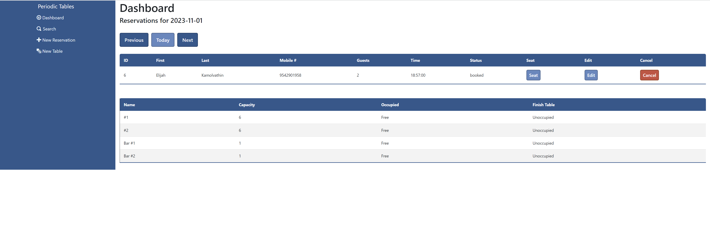
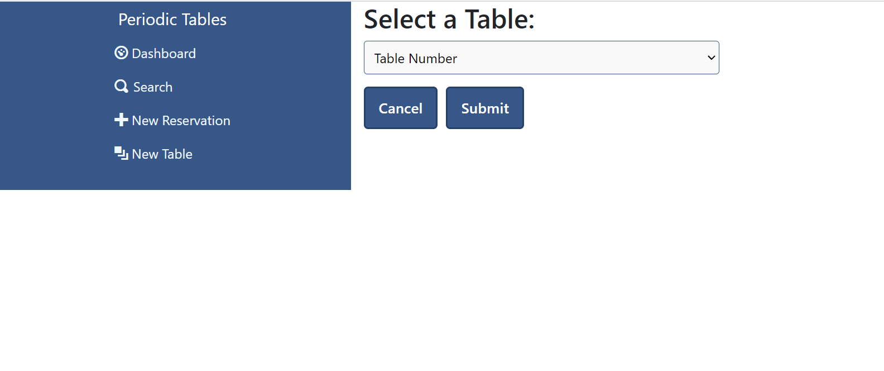
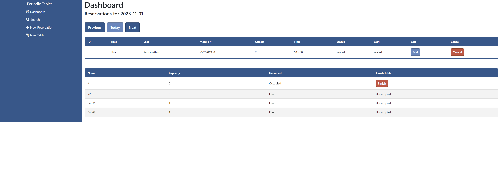
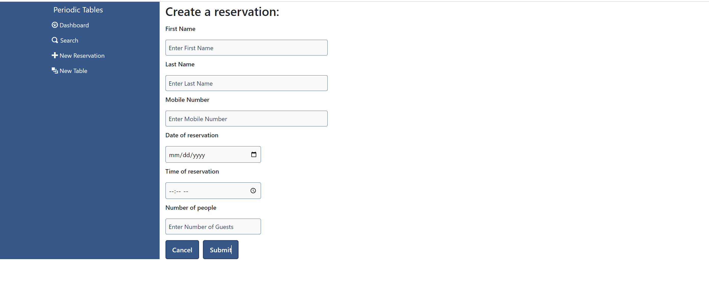
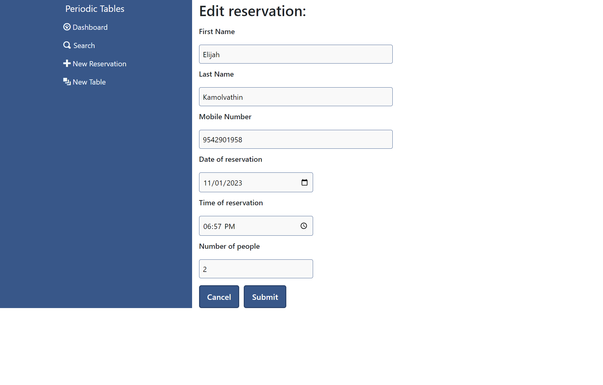
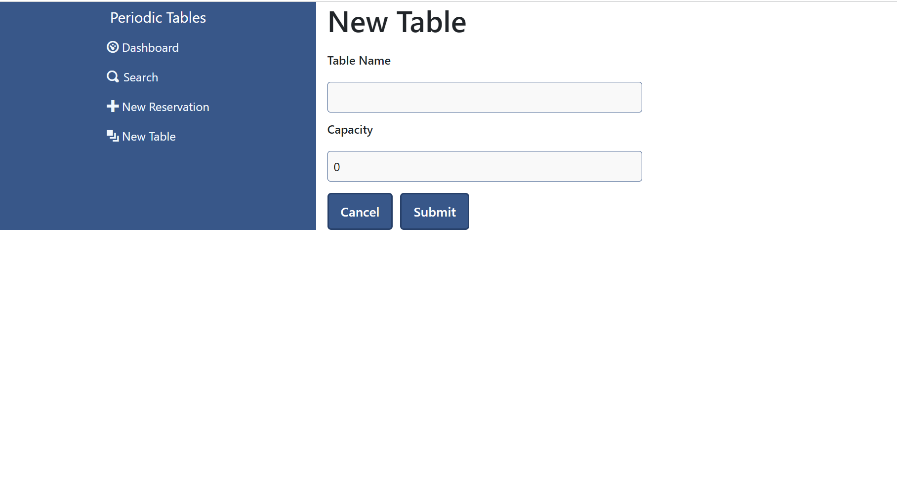
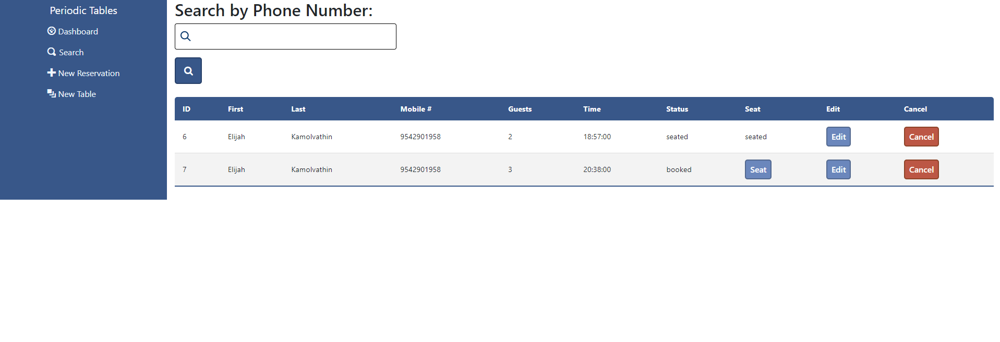

# Capstone: Periodic Table - Restaurant Reservation System

> You have been hired as a full stack developer at _Periodic Tables_, a startup that is creating a reservation system for fine dining restaurants.
> The software is used only by restaurant personnel when a customer calls to request a reservation.
> At this point, the customers will not access the system online.

This is my submission for Thinkful's final capstone project, a full-stack restaurant reservation system.

### Technologies used
- Javascript
- React: Frontend JS library used to build the UI
- CSS: Used to style the UI
- Express: Framework used for handling routing, middleware and creating a RESTful API
- Knex: SQL query builder used for my SQL database
- SQL: Used to manage and query the relational database of the project

### Dashboard

The dashboard/homepage displays a list of reservations for a given date, defaulting to the current date.
The list of reservations contains key information for each reservation including the ID, name, phone number, number of guests attending, the time and status of the reservation.
The list of tables is also displayed on the homepage with more key information including the ID, capacity of the table, and the occupied status of the table.
Once a reservation has been seated at a table, the table will become occupied and the Finish button will be displayed
Choosing to seat a reservation will bring the user to the seat reservation page, where they will select the table to seat the reservation.
Only tables with suitable capacity will be available.

Both the finish and cancel buttons allow the user to change the status of a reservation to one which will no longer display on the dashboard, "finished" and "cancelled" respectively.

### Creating reservations

If the user wants to create a new reservation, periodic tables makes it pain free to do so.
From the new reservation page, user can enter all necessary information into the form with some validation checks.
- All fields are required
- The mobile number must have the correct number of characters and may only contain numbers
- The date must be a future date and cannot be on Tuesdays, as the restaurant is closed on Tuesdays
- The time must be between 10:30am and 9:30pm, since this is the time that the restaurant is open
The cancel button will simply bring the user to the previous page they were on.
The submit button will create the new reservation and bring the user to the dashboard for the date of the new reservation.

### Editting reservations

Once a reservation is created, the user may want to edit the information inputted.
Clicking the edit button on a reservation will bring the user to the edit reservation screen for the given reservation.
The form will be prefilled with all of the original information for the reservation.
This form will, of course, have all of the same validation as the new reservation page.

### Creating tables

If the user wants to create a new table, all that is required is a table name longer than 2 characters and a table capacity greater than 0.
The cancel button will bring the user to the previous page they were on.
The submit button will create the new table to be displayed and bring the user to the dashboard.

### Searching for reservations

If the user wants to find specific reservations, they may do so by searching for a reservation through their mobile number.
Once a number has been searched, the page will display a list of all associated reservations, including past and cancelled reservations.

All pages are responsive.